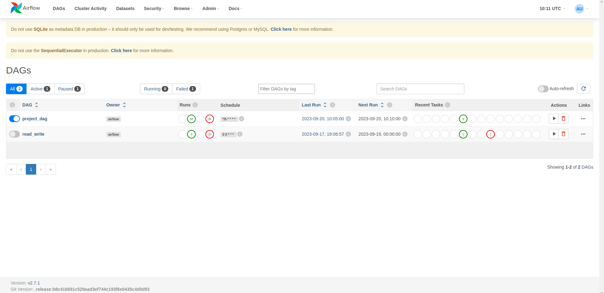
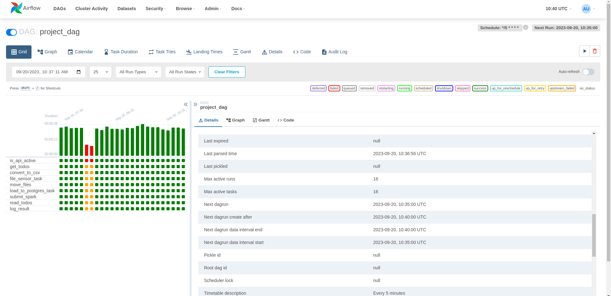
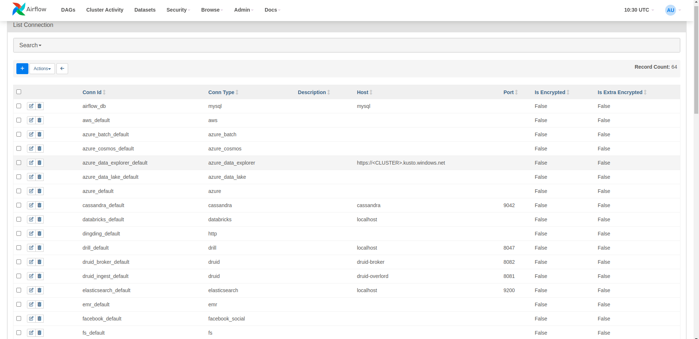

# Airflow Individual Project

This README provides an overview of the Apache Airflow DAG named "project_dag" created for a specific data pipeline task. This DAG is designed to periodically fetch data from an API, convert it to CSV format, load it into a PostgreSQL database, and then execute a Spark job on the data.

## Airflow UI

* Airflow has its own UI that runs in the port localhost:8080 in the computer. A brief view of the homepage of the UI

## DAG Structure

The "project_dag" DAG is structured as follows:

1. **is_api_active**: This task checks if the target API is active before proceeding.

2. **get_todos**: Fetches data from the API using an HTTP GET request and stores it in XCom for later use. The response data is filtered to extract relevant information.

3. **convert_to_csv**: Converts the JSON data obtained from the API into a CSV file format. The resulting CSV file is saved at `/home/ubuntu/airflow/Airflow_assignments/todos.csv`.

4. **file_sensor_task**: Monitors the existence of the CSV file at the specified path. It waits until the file is available before proceeding.

5. **move_files**: Moves the CSV file from the original location to `/tmp/` for later loading into the database.

6. **load_to_postgres_task**: Loads the CSV data into a PostgreSQL database table named `todos_table` after truncating its previous contents. It uses the `/tmp/todos.csv` file for data source.

7. **submit_spark**: Submits a Spark job using the `spark-submit` command, which processes the data in some way (as indicated by the provided script path).

8. **read_todos**: Executes a SQL query to retrieve data from the `todos_table_spark` table in the PostgreSQL database.

9. **log_result**: Logs the retrieved data from the PostgreSQL database to the console.

### IN UI :

## Schedule and Dependencies

- The DAG is scheduled to run every 5 minutes, starting from September 15, 2023, and does not catch up on missed runs.

- Task dependencies are defined to ensure proper execution order: `is_api_active` -> `get_todos` -> `convert_to_csv` -> `file_sensor_task` -> `move_files` -> `load_to_postgres_task` -> `submit_spark` -> `read_todos` -> `log_result`.

## Operators and Sensors used : 

1. **PythonOperator**:
   - Executes a custom Python function as a task within the DAG, enabling you to incorporate Python code and logic into your workflows.

2. **BashOperator**:
   - Runs shell commands or scripts as tasks, allowing you to integrate command-line operations into your DAGs.

3. **PostgresOperator**:
   - Executes SQL queries or scripts on a PostgreSQL database, facilitating database interactions and data manipulation.

4. **SimpleHttpOperator**:
   - Sends HTTP requests, such as GET or POST, to external endpoints, making it easy to integrate with web services and APIs.

5. **HttpSensor**:
   - Waits for an HTTP endpoint to return a response before proceeding with the DAG, ensuring dependencies on external services are met.

6. **FileSensor**:
   - Monitors the existence of files at specified paths, enabling your workflow to proceed when necessary files become available.

## Connections Used:

1. **HttpConnection**:
   - Configures and stores information for HTTP endpoints or APIs, including URLs and authentication credentials.

2. **PostgresConnection**:
   - Sets up connections to PostgreSQL databases, specifying host, port, database name, username, and password. Used for SQL queries, data loading, and database interactions.

### IN UI:

## TO run the project: 

1. Ensure that you have Apache Airflow and the required dependencies installed as  in the requirements.txt.

2. Configure the Airflow connections for HTTP (http_airflow) and PostgreSQL (write_postgres) in the Airflow UI.

3. Place your Spark script (`script.py`) in `/home/ubuntu/airflow/python_scripts/` directory.

4. Run the DAG by placing it in the appropriate DAGs folder and initiating the Airflow scheduler.

5. Monitor the DAG's execution in the Airflow UI and check the logs for any issues.

6. The results of the Spark job and PostgreSQL queries will be logged to the console.

## Author

- [Prateek Pudasainee] !([Email](prateek.pudasainee@fusemachines.com)

